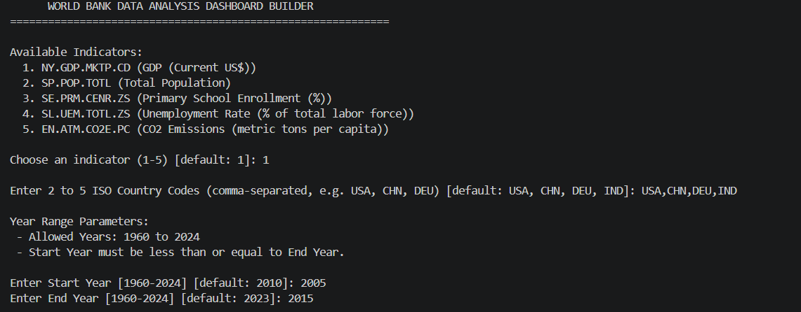
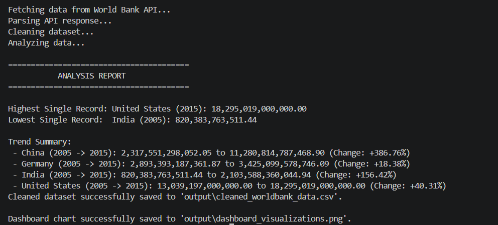
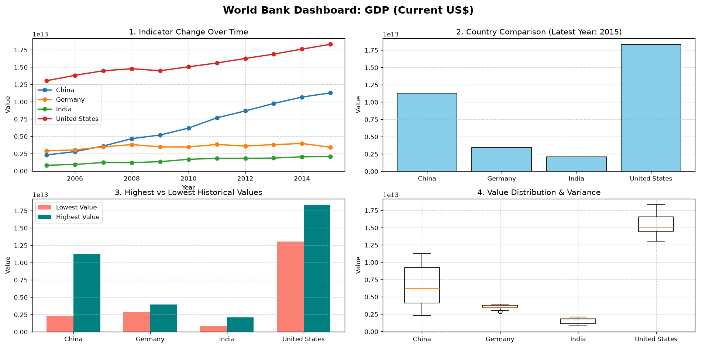
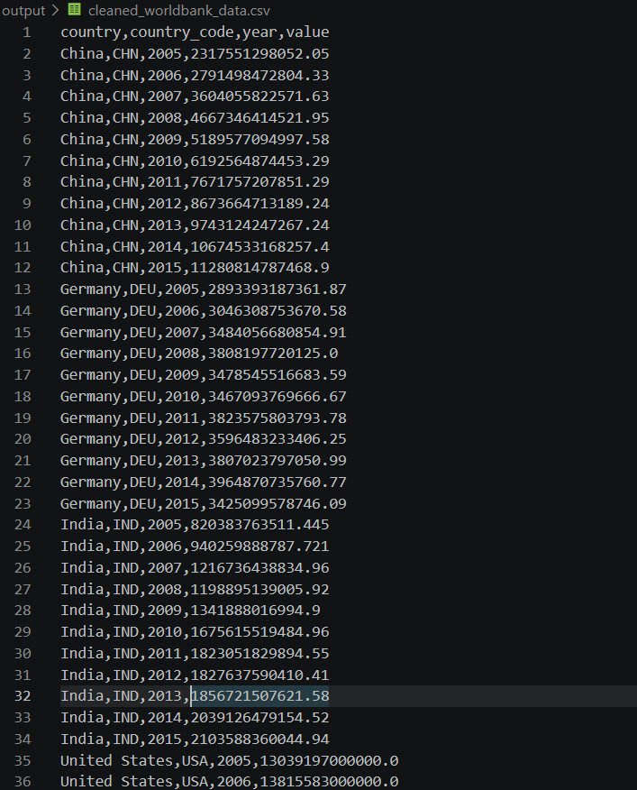

# World Bank Data Analysis Dashboard

A Python application that uses the World Bank API to collect, clean, validate, analyze, and visualize economic and social indicators across selected countries and years.

## What This Project Does

The application allows the user to choose:

- A World Bank indicator
- 2–5 countries using ISO3 country codes
- A start year
- An end year

The program then:

1. Fetches data from the World Bank API
2. Parses the JSON response
3. Cleans and validates the dataset
4. Analyzes trends and country-level changes
5. Generates visualizations
6. Saves the cleaned dataset and dashboard output

## Data Pipeline

User Input
    ↓
World Bank API
    ↓
JSON Response
    ↓
Data Cleaning
    ↓
Data Validation
    ↓
Data Analysis
    ↓
Visualization
    ↓
CSV + Dashboard

## Analysis

The program calculates:

- Highest and lowest recorded values
- Country-level changes over the selected period
- Percentage change between the first and last available year
- Mean values
- Historical minimum and maximum values
- Value distribution

## Visualizations

The dashboard contains four visualizations:

- Indicator change over time
- Country comparison for the latest year
- Highest vs. lowest historical values
- Value distribution and variance

### Dashboard

### Analysis Report

### Graph

### CSV Output

## Error Handling

The application includes checks for:

- API connection failures
- Request timeouts
- HTTP errors
- Invalid API responses
- Missing data
- Invalid country codes
- Duplicate country selections
- Invalid year ranges
- Empty datasets
- CSV export failures
- Visualization/output errors

The program reports these problems to the user rather than terminating unexpectedly.

## Technologies Used

- Python
- Requests
- Pandas
- Matplotlib
- World Bank API

## Output

The program generates:

- cleaned_worldbank_data.csv
- dashboard_visualizations.png

## How to Run

Install the required packages:

- pip install pandas matplotlib requests

Run the application:

- python api_dashboard.py

Follow the prompts to select the indicator, countries, and year range.

## Data Source

[World Bank Open Data API](https://data.worldbank.org/)

## Skills Demonstrated

- Python programming
- REST API integration
- JSON parsing
- Pandas data processing
- Data cleaning
- Data validation
- Data analysis
- Data visualization
- Exception handling
- File output
